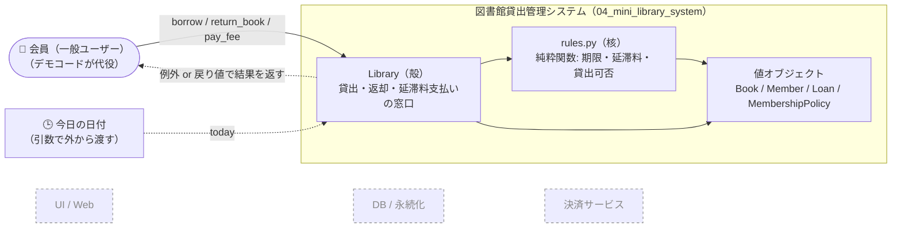
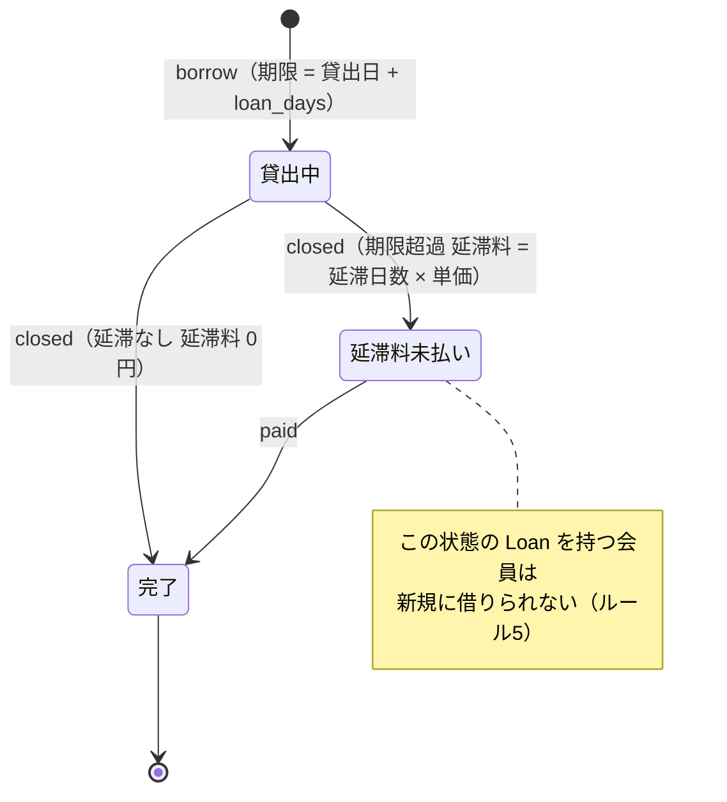
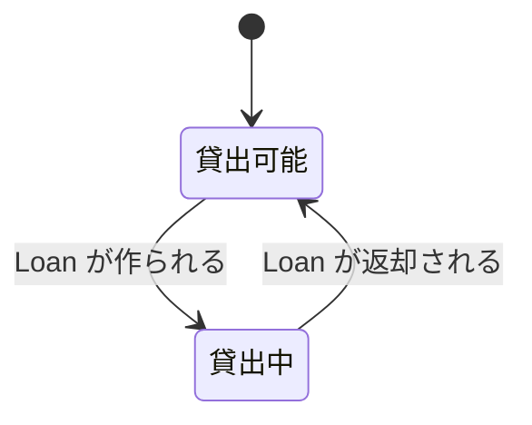
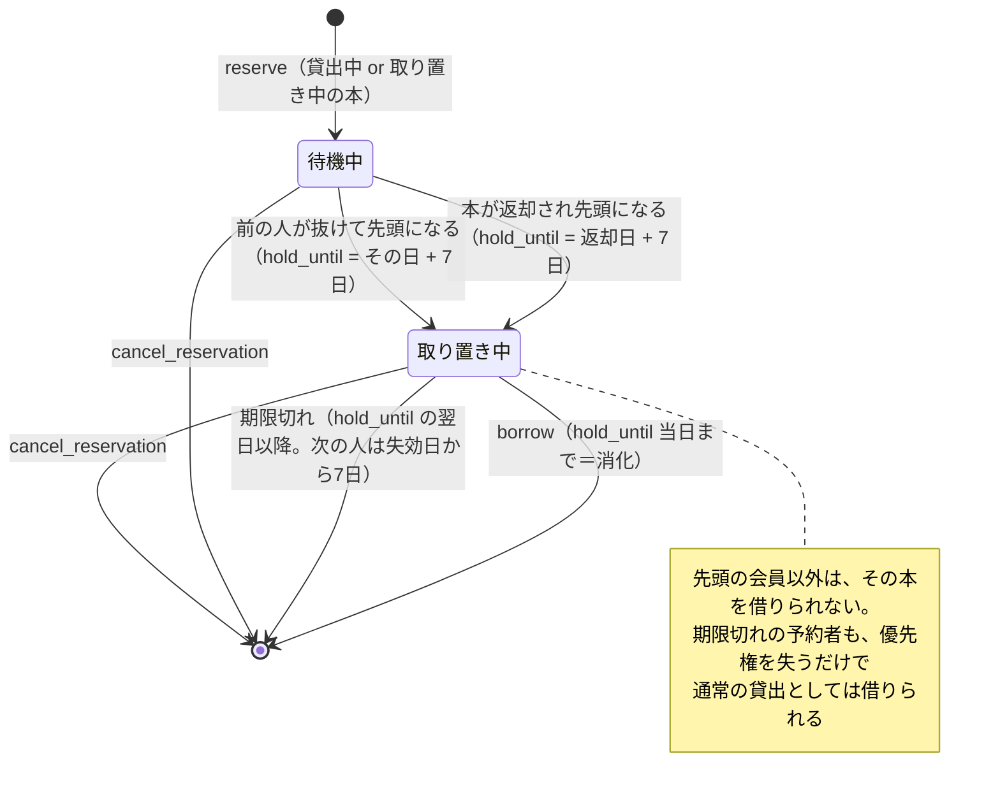
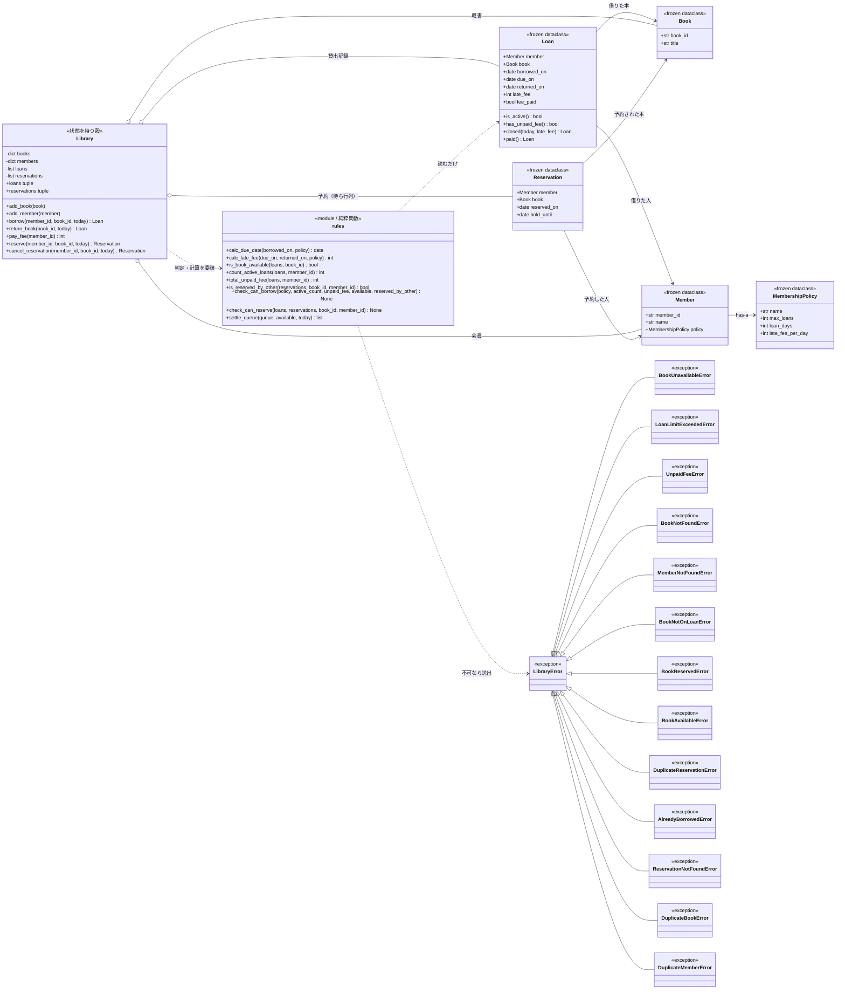
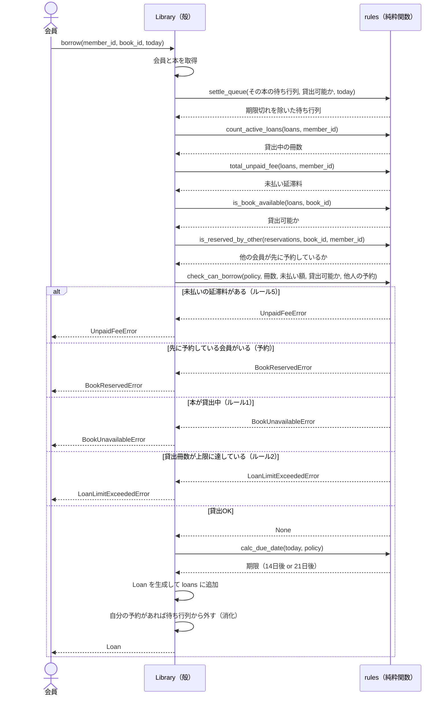
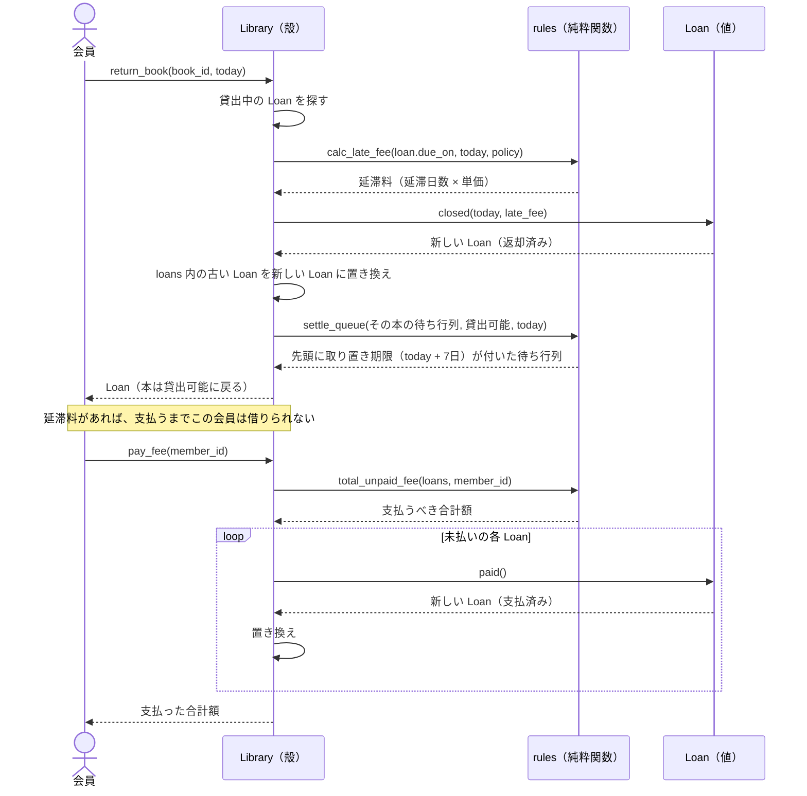
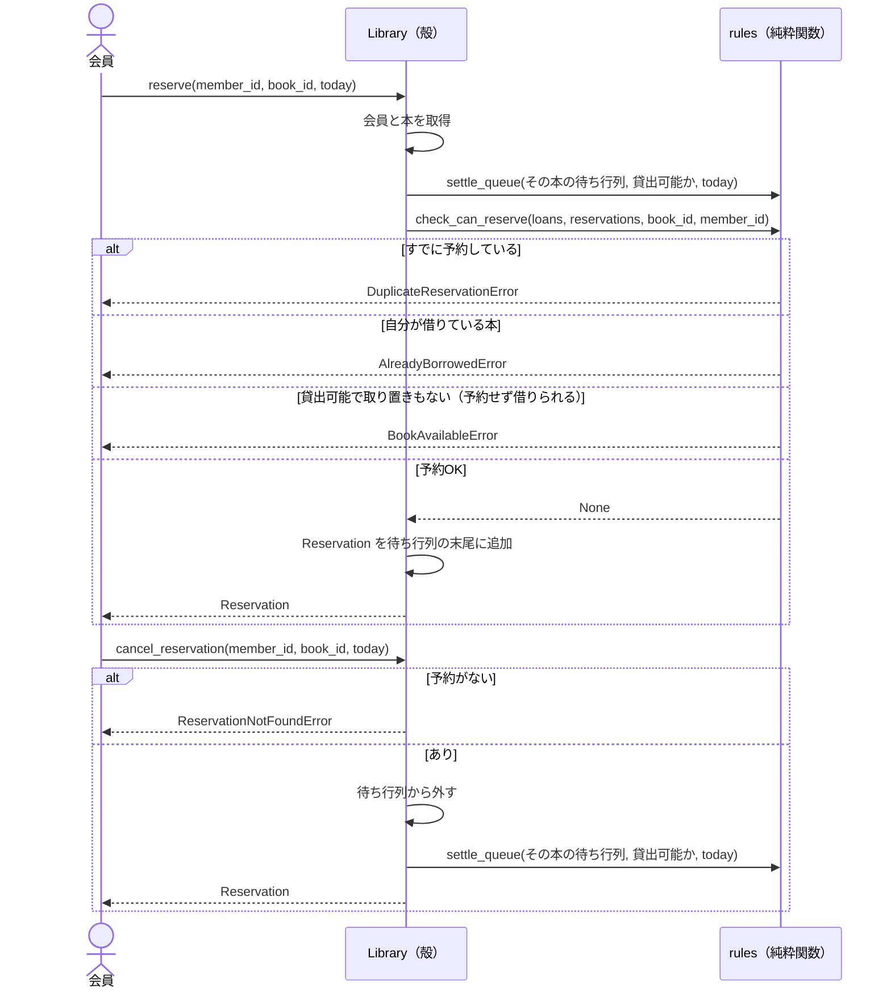

# 04_mini_library_system: 設計図

図書館の貸出管理システムの設計メモです。図は [Mermaid](https://mermaid.js.org/) で書いています（VS Code の Markdown プレビュー / GitHub で描画できます）。

**設計の前提**
- 会員種別の違いは数値だけなので、継承せず `MembershipPolicy` を `Member` に持たせる（コンポジション）
- 「貸出中か」は `Book` にフラグを持たず、`Loan` から導出する（二重管理しない）
- 延滞料と支払状況は `Loan` が持つ。会員の未払い額は、その会員の `Loan` の未払い分の合計で求める
- 延滞料は**返却時に確定**する（返却前の延滞中は料金が未確定）
- **予約**: 貸出中（または予約者に取り置き中）の本に順番待ちを入れられる。待ち行列は FIFO で、先頭の会員だけが借りられる。借りる/キャンセルで待ち行列から外れる。取り置きは返却から7日間で、過ぎると失効して次の人に移る（期限切れの判定は、操作されたときに行う遅延評価）
- **純粋関数の核 + 状態を持つ殻**（functional core, imperative shell）
  - 期限計算・延滞料計算・貸出可否の判定は `rules.py` の純粋関数にする
  - `Book` / `Member` / `Loan` / `MembershipPolicy` はイミュータブル（`frozen=True`）。返却・支払いは新しい `Loan` を返す
  - 状態を変更するのは `Library` だけ

### どこが純粋で、どこが状態を持つか

| 層 | 要素 | 性質 |
| --- | --- | --- |
| 核（純粋） | `rules.py` の関数群 | 引数だけで結果が決まる。副作用なし。日付も引数で受ける |
| 核（値） | `Book` / `Member` / `Loan` / `MembershipPolicy` | イミュータブルな値オブジェクト |
| 殻（状態） | `Library` | 蔵書・会員・貸出記録を保持し、核を呼んで結果を反映する |

---

## 1. コンテキスト図

システムの境界と、外との関わりを示します。このシステムの範囲は「ドメインモデル」だけで、UI・DB・決済は含みません。

> 点線の灰色ボックスは**スコープ外**です。「今日」を引数で受けるのは、延滞のテストを書きやすくする（時刻という副作用を持ち込まない）ためです。

---

## 2. 状態遷移図

### 2-1. `Loan`（貸出）の状態

`Loan` はイミュータブルなので、遷移のたびに**新しい `Loan` 値**が作られます（`dataclasses.replace`）。

### 2-2. `Book`（本）の状態（`Loan` から導出）

`Book` 自身は状態を持ちません。「返却日が未設定の `Loan` があるか」で決まります。

### 2-3. `Reservation`（予約）の状態

予約は待ち行列に並ぶ値で、履歴は持ちません。外れる（消化・失効・キャンセル）と行列から消えます。
取り置き期限（`hold_until`）は、本が貸出可能になった時点で**先頭の予約だけ**に付きます。

---

## 3. クラス図

> - 会員種別は `REGULAR` / `STUDENT` という `MembershipPolicy` の**インスタンス**です。クラスを増やさずに種別を追加できます。
> - `rules` は状態を持たないので、クラスではなくモジュールの関数として書きます。

---

## 4. シーケンス図

### 4-1. 本を借りる（`borrow`）

ルール 1・2・5 と予約の判定は純粋関数 `check_can_borrow` が行います。`Library` は材料を集めて渡し、結果を反映するだけです。

### 4-2. 本を返して、延滞料を払う（`return_book` → `pay_fee`）

期限を過ぎて返却した場合の流れです（ルール 3・4・6）。`Loan` は更新せず、新しい値に**置き換えます**。

### 4-3. 予約する・キャンセルする（`reserve` / `cancel_reservation`）

---

## 5. 設計の決めごと（ADR 風メモ）

| 決めたこと | 理由 | 別案 |
| --- | --- | --- |
| 会員種別は `Member` を継承せず `MembershipPolicy` で表現 | 違いが数値だけで、振る舞いは同じ | 継承 / Strategy（計算ロジックが変わるなら昇格） |
| 貸出状態は `Loan` から導出 | `Book` のフラグとの二重管理を避ける | `Book.is_borrowed` フラグ |
| 延滞料は `Loan` が持つ（A案） | 履歴が残り、更新箇所が一つで済む | `Member.unpaid_balance`（B案） |
| 延滞料は返却時に確定 | 実装が単純。返却前は金額が未確定 | 日次で加算する |
| 判定順は 未払い → 貸出中 → 上限 | 会員側の問題を先に伝える | 任意（要検討） |
| ロジックは `rules.py` の純粋関数に切り出す | 入力だけで結果が決まり、モックなしでテストできる | 各クラスのメソッドに持たせる（OOP寄り） |
| 値オブジェクトはイミュータブル（`frozen=True`） | 状態変更を `Library` に閉じ込められる | ミュータブルな `Loan.close()` |
| 不可の判定は純粋関数から例外を送出 | Pythonらしく単純。同じ入力なら必ず同じ例外なので決定的 | `Result` 型や理由の戻り値で返す（より FP 寄り） |
| 予約は貸出中または取り置き中の本だけ可能 | 借りられる本は予約せず借りればよい。取り置き中も3人目が並べるようにする | 貸出中の本のみ |
| 取り置き期限は返却から7日間（`HOLD_DAYS`） | 先頭が来ない・未払いで借りられない場合に、行列が塞がるのを防ぐ | 期限なし |
| 期限は `Reservation.hold_until` として先頭にだけ持たせる | 貸出中は期限が進まず、前の人が抜けた日から次の人の期限が始まる | 返却日から全員分を一律に計算（キャンセルで計算がずれる） |
| 期限切れの判定は操作時の遅延評価（`settle_queue` が純粋関数） | 定期ジョブが要らず、「今日」を引数で渡せばテストできる。放置されても失効日から連鎖して判定できる | 日次バッチで失効させる |
| 失効した予約者は優先権を失うだけ | 期限後は本が空いていれば誰でも借りられる。通知は発展課題（02 と連携） | 失効した予約者は借りられない |
| `check_can_borrow` に `reserved_by_other=False` を追加 | 判定順（未払い → 予約 → 貸出中 → 上限）を保ち、既存の呼び出しを壊さない | 別の判定関数にする（順序が崩れる） |
| 予約は履歴を持たず待ち行列から外す | 状態を持たない方針と整合。履歴が必要なら永続化と合わせて再検討 | `status` 付きで残す |
