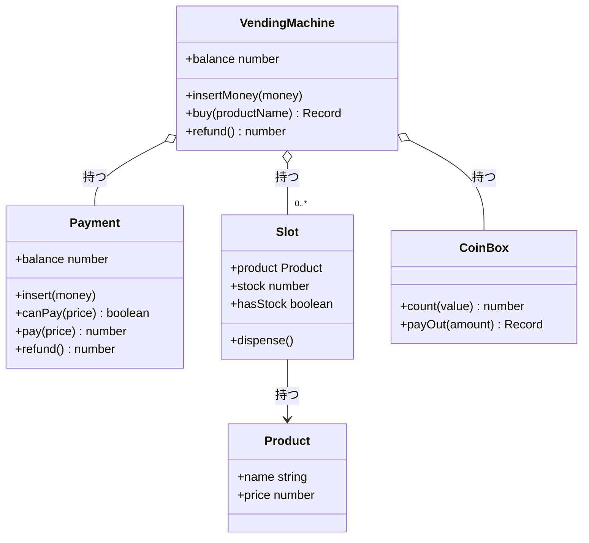
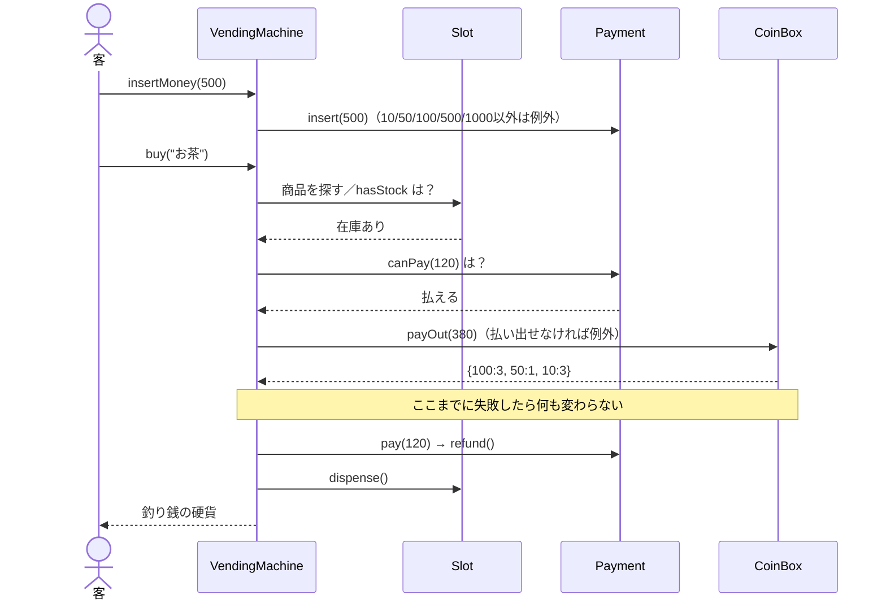

# 05_vending_machine_with_tdd: 設計図

自動販売機の設計メモです。TDDで育てるので、**今コードにあるものだけ**を書き、増えたら更新します。図は [Mermaid](https://mermaid.js.org/) です（VS Code の Markdown プレビュー / GitHub で描画できます）。

**設計の前提**
- 責務ごとにクラスを分け、`VendingMachine` は部品に聞いて判断をまとめる窓口にする
- 状態を持つクラスは、フィールドを `private` にして getter 経由で読ませる。変わらない値は `readonly` で公開する
- `buy` は**全部のチェックを通してから状態を変える**。途中で失敗しても、在庫・残高・釣り銭箱は変わらない
- `print` はしない。結果は戻り値か例外で返す

---

## 1. クラス図（現状）

| クラス | 責務 | 持つ状態 |
| --- | --- | --- |
| `Product` | 商品の名前と価格 | 不変 |
| `Slot` | 1列ぶんの商品と在庫 | 在庫数 |
| `Payment` | 投入された金額の管理（検証・支払い・払い戻し） | 残高 |
| `CoinBox` | 釣り銭用の硬貨の枚数と、払い出しの組み合わせ | 額面ごとの枚数 |
| `VendingMachine` | 上の部品を束ねる窓口 | 部品への参照 |

---

## 2. 購入の流れ（`buy`）

---

## 3. 実装済みのルール

| README | ルール | 担当 | テスト |
| --- | --- | --- | --- |
| 1 | 10/50/100/500/1000円のみ受け付ける | `Payment` | `存在しない金額(7円)は投入できないこと` |
| 2 | 商品は名前・価格・在庫を持つ | `Product` / `Slot` | `列は商品と在庫を持つこと` ほか |
| 3 | 買える（釣り銭を返す） | `VendingMachine.buy` | `購入すると釣り銭を返し、在庫と残高が減ること` |
| 4 | 残高不足・在庫切れは買えない | `Payment` / `Slot` | `残高が足りないと購入できず…` `在庫切れだと購入できず…` |
| 5 | 釣り銭切れは買えない | `CoinBox` | `釣り銭を払い出せないと購入できず…` |
| 6 | 払い戻しで残高が0に戻る | `Payment.refund` | `払い戻しすると…` |

---

## 4. これからの予定

- **ルール7（支払い方法の差し替え）**: `Payment` を現金／ICカードで差し替えられるようにする（Strategy か継承）
- **ルール8（売上集計）**: 商品別の販売数・金額
- 投入された硬貨は、いまは釣り銭箱に入らない（釣り銭箱は初期値のまま）

> 決まったら、ここをクラス図・ルール表に反映していく。
