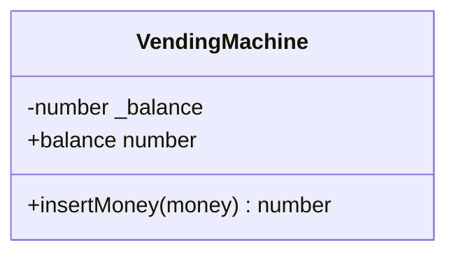

# 05_vending_machine_with_tdd: 設計図

自動販売機の設計メモです。TDDで育てるので、**今コードにあるものだけ**を書き、増えたら更新します。図は [Mermaid](https://mermaid.js.org/) です。

**設計の前提**
- 状態（残高）は `VendingMachine` が持ち、外からは getter でしか読めない（カプセル化）
- `print` はしない。結果は戻り値か例外で返す

---

## 1. クラス図（現状）

---

## 2. 実装済みのルール

| 区分 | ルール | テスト |
| --- | --- | --- |
| 土台 | 初期状態の残高は 0 円 | `初期状態では残高が0円であること` |
| 土台 | お金を投入すると残高が増える | `お金を投入すると残高が増加すること` |

---

## 3. これからの予定（README のルール 1〜8）

責務の候補（**テストが分けたがったら**切り出す。最初から作り込まない）:

- お金（`Money` / 硬貨の種類）: 受け付ける金額の検証
- 商品と在庫（`Product` / `Slot`）
- 釣り銭の管理（硬貨の枚数を持ち、払い出せるか判断する）
- 支払い方法（現金 / ICカード。差し替え可能にする）
- `VendingMachine`: 上記を束ねる窓口

> 決まったら、ここをクラス図・ルール表に反映していく。
